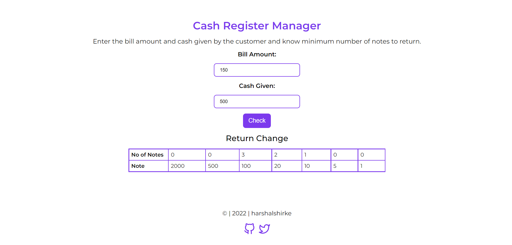

# cash-register-manager

A cash register manager which helps the user by telling how can he/she return the change to the customer with minimum number of notes.

# Preview

# Tech Stack:
- HTML
- CSS
- JavaScript